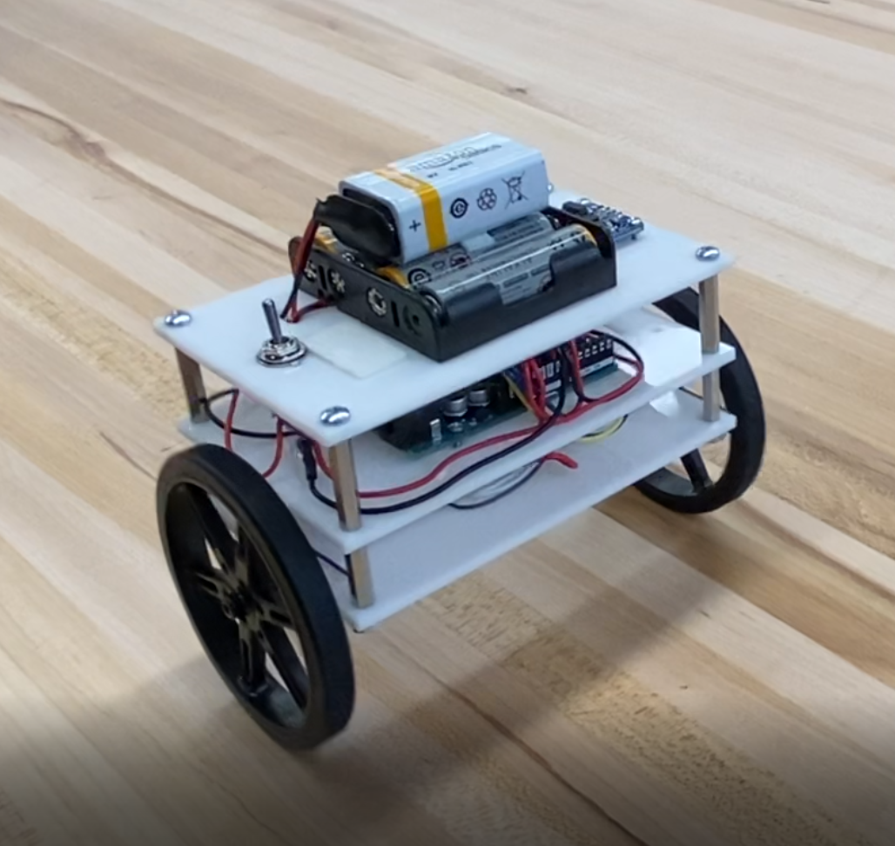
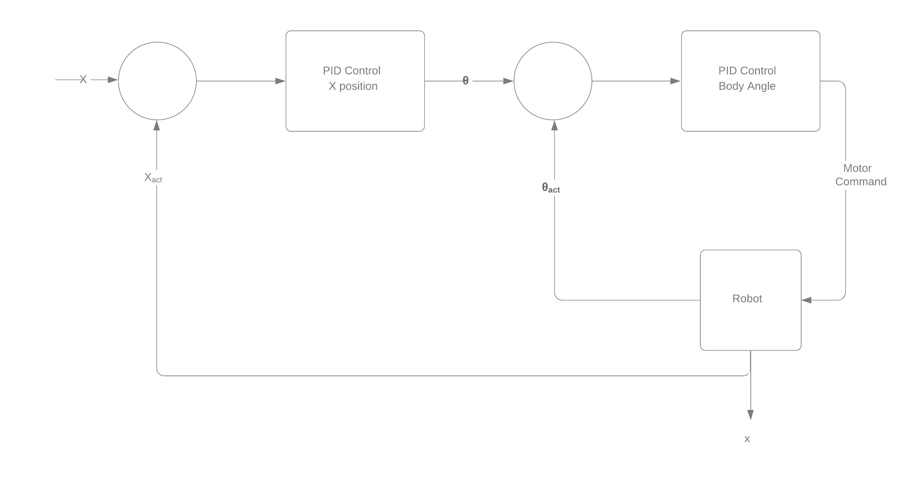
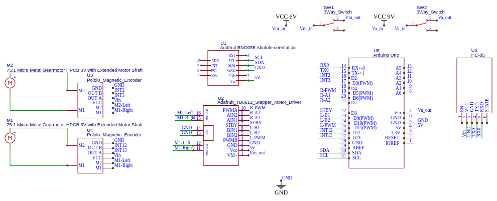

# Self Balancing Robot Project

This was a project to design and build a two-wheeled, self balancing robot that has a compact form factor. The challenge is that shorter the body design, the harder it is for the robot to easily maintain its balance. Since the feasibility of this system is not obvious, first the robot dynamics were solved and used to create a simulation of the system. This simulation was then used to inform the design and component selection process.

[Summary Video](https://www.youtube.com/watch?v=kY2ciNZqLZk)

This repository contains:
- A python script to the dynamics of the system and determine the equations of motion
- A ROS package that uses the equations of motion to simulate the self balancing robot
- Design files and BOM of the robot
- Arduino script to control the robot.

## How to use this repo:

If you want to use this repository to design your own self balancing robot or just recreate the iteration shown above, follow these steps:

**1) Run the  file `SelfBalancing_AllSymbolic.py`.**

Requires: python3, sympy, numpy, scipy, and pickle

This file will symbolically solve the Euler-Lagrange equations to derive the equations of motion that characterize a two wheeled, self balancing robot. This will generate a set of pickle files that are used to transfer the equations to the ROS simulation. This file takes about **30 min to fully run** due to the amount of symbols being processed, but your mileage may vary. If you would like to see the actual solutions, the raw Latex code is in the 'solutions.txt' file or you can run the `print_solutions.py` file.

See `derivations.pdf` in the documentation folder for more information on the system setup and derivation of the equations.

**2) Simulate the robot by launching `self_balance.launch`.**

Requires: ROS Melodic

This will launch the simulation using the default settings used to for the design files in this repo. Once loaded, call the `/start` service to start the simulation. You will need to update the `file_path_params.yaml` in the `simulate` node to update the locations of where to find pickle files you generated earlier.

Package Desciption:
  - `dynamics`: This package contains all of the files relevant to the computational component of the simulation. The `simulate` node uses an RK4 integration method combined with the symbolic equations of motion to compute the robot state for every time step. The robot state is then fed into a PID control scheme to compute the required motor torque to keep the robot upright following this control scheme shown below.

    - If you would like to customize the simulation to your own parameters, modify the `robot_params.yaml` file to simulate a different robot configuration. These parameters are best pulled from CAD files, see the included CAD mass properties images in the documentation directory for an example.

    - To modify the controller gains, change the values in the `controller_param.yaml` file.
     

 - `visualization`: This package contains all of the files relevant to the visual component of the simulation. The included launch file displays the `balance_bot.urdf.xacro` and is useful if you want to modify the existing model.

  - To use your own mesh, save an STL for your wheel and an STL for the robot body assembly and place them in the `meshes` directory. Either call your files the same name or update the file names inside of `balance_bot.urdf.xacro` to match your files.

**3) Build it!**

The files located in the `Prototyping` directory should be everything you need to build your own or use the insights gained to make your own modifications.

It contains:
 - CAD files
 - PDFs for laser cutting
 - Bill of materials
 - Wiring Diagram (shown below)
 - Arduino Source Code:   
 Required libraries:
 Adafruit BNO055,
 Adafruit Unified Sensor,
 EnableInterrupt by Mike Schwager,
 PID by Brett Beauregard,
 QuadratureEncoder by Cheng Saetern

There is an extra svg file called `motorSpacer.svg` that is meant for laser cutting an extra part not currently in the CAD. This piece goes between the motor and the bottom plate so that the encoder wires do not pinch the rotating magnet and stall the motors.

Currently the code does not actually incorporate the encoders to accomplish the position control component of the simulation.

## Future Plans

This repository is for an active project and a lot of insight was drawn from the first design.

- Integrate simulation functionality for different torques applied to each wheel. This will enable the simulation to turn and eventually follow waypoints.

- Construct a V2 robot that will be able to balance unteathered.

- Incorporate encoders into the V2 control scheme

V2 is currently in-progress and the design will be largely the same but incorporating the changes mentioned at the end of the video.

1) The actual V1 build came out much heavier
