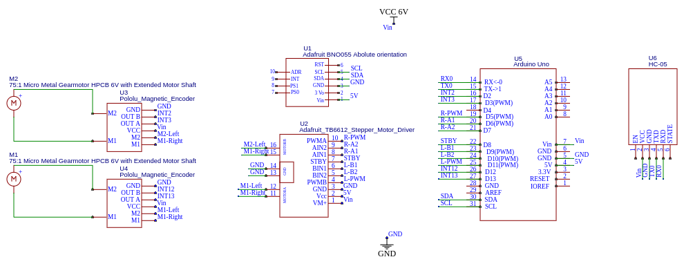

# Self Balancing Robot Project

This was a project to design and build a two-wheeled, self balancing robot that has a compact form factor. The challenge is that shorter the body design, the harder it is for the robot to easily maintain its balance.

This repository contains:
- A python script to the dynamics of the system and determine the equations of motion
- A ROS package that uses the equations of motion to simulate the self balancing robot
- Design files and BOM of the robot
- Arduino script to control the robot.

## How to use this repo:

If you want to use this repository to design your own self balancing robot or just recreate the iteration shown above, follow these steps:

1) Run the  file `SelfBalancing_AllSymbolic.py`.

Requires: python3, sympy, numpy, scipy, and pickle

This file will symbolically assemble and solve the Euler-Lagrange equations for the equations of motion that characterize a two wheeled, self balancing robot. This will generate a set of pickle files that are used to transfer the equations to the ROS simulation. This file takes about **30 min to fully run** due to the amount of symbols being processed, but your mileage may vary. If you would like to see the solutions, run the `print_solutions.py` file.

See the derivations pdf in the documentation folder for more information on the system setup. 

2) Simulate the robot using ROS

Requires: ROS Melodic

To run the simulation, use the launch file `self_balance.launch` This will launch the simulation using the default settings used to for the design files in this repo. If you would like to customize the simulation to your own parameters. Modify the `robot_params.yaml` file with your own parameters to simulate a different robot configuration. To modify the controller gains, change the values in the `controller_param.yaml` file.

The simulation controller follows this flowchart:

3) Use the information from the simulation to select motors and refine the design

